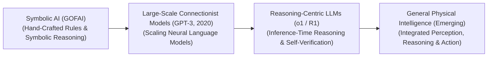
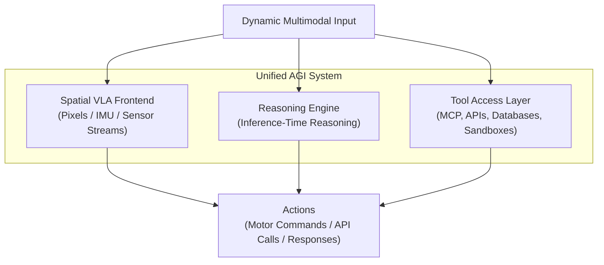

# Awesome-Artificial-General-Intelligence
## Artificial General Intelligence (AGI): History, Progression, Levels, & Paradigms

Artificial General Intelligence (AGI)—alternatively conceptualized as Human-Level AI, Strong AI, or General Embodied Intelligence—is the foundational frontier paradigm in computer science denoting an autonomous system that matches or surpasses human cognitive capabilities across the entire spectrum of economically valuable tasks. Unlike narrow AI systems (Narrow AI), which are hardwired to optimize for highly specific, bounded domains (e.g., medical pathology segmentations [INDEX: 1], image text-scaling filters [INDEX: 21], or chess-tree algorithms [INDEX: 18]), an AGI system possesses the capacity to synthesize abstract concepts, adapt to entirely novel and un-indexed environmental distributions, engage in multi-step reflective reasoning (System 2 thinking) [INDEX: 1], and transfer learned logical heuristics across entirely disparate domains on-the-fly without human structural interventions.

---

## 1. The Macro Chronological Evolution

The conceptual framework governing general machine intelligence has transitioned from rigid symbolic logic rules to deep connectionist scaling models, moving toward native reinforcement-learned reasoning loops and multi-modal physical grounding world adapters.

| Era | Concept | Limitation / Significance | Year First Used | Paper Link |
| :--- | :--- | :--- | :--- | :--- |
| [**The Symbolic & Good Old-Fashioned AI Era (GOFAI Baseline, ~1950s–1980s)**](./details/the_symbolic_good_old_fashioned_ai_era_gofai_baseline_1950s_1980s.md) | The historical genesis of the field born during the Dartmouth Workshop (1956). Early researchers conceptualized general intelligence as a purely symbolic manipulation task. They engineered complex, hand-crafted expert rule networks, LISP predicate calculus systems, and symbolic processing loops (e.g., Newell & Simon's General Problem Solver). | **Limitation:** The Moravec's Paradox and Combinatorial Explosion. The systems were mathematically brittle; they could solve high-level abstract logic puzzles but collapsed instantly when exposed to low-level unstructured sensory perception tasks like tracking a physical object or interpreting conversational variance. | 1961 | [GPS, a program that simulates human thought](https://doi.org/10.1145/366119.366120) |
| [**The Connectionist and Autoregressive Scale Era (~2018–2023)**](./details/the_connectionist_and_autoregressive_scale_era_2018_2023.md) | Dismantled symbolic rules, proving that general representations could emerge natively from web-scale data pre-training. Autoregressive transformers scaled parameter footprints to hundreds of billions of channels, giving rise to **In-Context Learning (ICL)** and zero-shot prompt engineering. The network learned to generalize downstream task capabilities natively purely through self-supervised next-token prediction boundaries [INDEX: 22]. | **Limitation:** Bound by the "System 1 Intuition Wall" and static data limits. The models operated under a rigid constant-time inference limit, spitting out tokens stochastically without the ability to pause, verify, or calculate mathematical steps deliberately, leading to logical hallucinations under stress [INDEX: 1]. | 2017 | [Attention is all you need](https://arxiv.org/abs/1706.03762) |
| [**The Native Reinforcement-Learned Search & Reasoning Era (~2024–2025)**](./details/the_native_reinforcement_learned_search_reasoning_era_2024_2025.md) | Shifted the scaling laws from pre-training token datasets to inference-time compute parameters (System 2 thinking) [INDEX: 1, 15]. Pioneered by architectures like OpenAI’s o-series and DeepSeek-R1, it internalizes tree-search and self-correction directly within the model's parameters using large-scale Reinforcement Learning (RL) [INDEX: 1, 18, 21]. | **Significance:** The model generates a verbose, hidden "thinking trace" before outputting its final response [INDEX: 1]. It naturally learns to execute error backtracking, query local sandboxed compilers, and verify intermediate logic lines autonomously at runtime, matching or beating human PhD-level intelligence on complex competitive STEM and software engineering benchmarks [INDEX: 1, 17, 21]. | 2017 | [Mastering chess and shogi by self-play with a general reinforcement learning algorithm](https://arxiv.org/abs/1712.01815) |
| [**The General Physical Intelligence & Embodiment Era (~2025–Present)**](./details/the_general_physical_intelligence_embodiment_era_2025_present.md) | The current modern state-of-the-art frontier standard anchoring general cognitive intelligence within the physical laws of nature. It expands the tokenization framework past text strings into **spatial, temporal, and kinetic token spaces**. | **Significance:** Popularized by cross-modal Vision-Language-Action (VLA) foundation models running on distributed edge robotics and humanoid fleets. It unifies high-resolution computer vision, real-time trajectory optimization, and tokenized motor torque control into a single end-to-end multi-task policy, enabling hardware systems to seamlessly generalize across arbitrary physical environments, tool configurations, and manipulation scales zero-shot. | 2023 | [Levels of AGI: Operationalizing hope and anchor metrics for the frontier tracking of general artificial intelligence](https://arxiv.org/abs/2311.02462) |

---

## 2. Quantitative Classification: The 5 Levels of AGI

To transition away from unscientific anthropomorphic evaluations, contemporary framework standards (standardized by researchers at Google DeepMind) categorize general machine intelligence into strict operational performance tiers based on task breadth and human capability pacing.

| Level | Definition | Examples / Target Milestones | Year First Used | Paper Link |
| :--- | :--- | :--- | :--- | :--- |
| [**Level 0: No AI**](./details/level_0_no_ai.md) | Standard classic computing infrastructure. | Simple database query indices, hardcoded arithmetic processors, or traditional text-editing software scripts. | 1950 | [Computing machinery and intelligence](https://academic.oup.com/mind/article/LIX/236/433/986238) |
| [**Level 1: Emergent AGI**](./details/level_1_emergent_agi.md) | Matches or slightly outperforms an unskilled human operator across a wide, general array of conversational, linguistic, and information-retrieval tasks. | Standard pre-trained base LLMs and early chat-aligned foundation architectures. | 2023 | [Levels of AGI: Operationalizing hope and anchor metrics for the frontier tracking of general artificial intelligence](https://arxiv.org/abs/2311.02462) |
| [**Level 2: Competent AGI**](./details/level_2_competent_agi.md) | Outperforms at least the 50th percentile of skilled adult humans across a broad spectrum of cognitively demanding intellectual, professional, and software engineering domains. | Advanced, reinforcement-learned test-time compute reasoning models (such as o1/R1 lines) executing automated multi-file coding tickets and structural scientific derivations autonomously [INDEX: 1, 21]. | 2025 | [DeepSeek-R1: Incentivizing reasoning and verification capability in foundational language transformers via large-scale self-play reinforcement learning loops](https://arxiv.org/abs/2501.12948) |
| [**Level 3: Expert AGI**](./details/level_3_expert_agi.md) | Outperforms at least the 90th percentile of highly specialized human professionals and domain-expert PhDs across the global capability matrix. | Continuous autonomous publication of novel, peer-reviewed scientific whitepapers, de novo molecular pharmaceutical discoveries, and automated optimization of distributed network server code without human oversight. | 2023 | [Levels of AGI: Operationalizing hope and anchor metrics for the frontier tracking of general artificial intelligence](https://arxiv.org/abs/2311.02462) |
| [**Level 4: Virtuoso AGI**](./details/level_4_virtuoso_agi.md) | Outperforms the absolute 99th percentile of elite human masters, grandmasters, and historical historical visionaries across general tasks (analogous to an all-domain extension of AlphaZero's dominance over human chess masters) [INDEX: 18]. | *N/A* | 2017 | [Mastering chess and shogi by self-play with a general reinforcement learning algorithm](https://arxiv.org/abs/1712.01815) |
| [**Level 5: Superhuman AI (ASI)**](./details/level_5_superhuman_ai_asi.md) | Demonstrates absolute mathematical dominance, outperforming 100% of collective human capability across every conceivable metric, including long-horizon multi-agent world building, advanced physical engineering, and abstract mathematical innovation. | *N/A* | 2023 | [Levels of AGI: Operationalizing hope and anchor metrics for the frontier tracking of general artificial intelligence](https://arxiv.org/abs/2311.02462) |

---

## 3. High-Capacity Architectural & System Engineering Components

To coordinate and scale up general physical and cognitive operations smoothly, state-of-the-art AGI infrastructure topologies orchestrate a multi-layered neuro-symbolic stack.

| Component | Profile | Year First Used | Paper Link |
| :--- | :--- | :--- | :--- |
| [**Model Context Protocol (MCP) Integration Layers**](./details/model_context_protocol_mcp_integration_layers.md) | Standardizes model-to-tool client-server interactions [INDEX: 12]. Bypasses manual API engineering by allowing the general reasoning policy to automatically discover, authenticate, and control arbitrary external databases, system terminal shells, web browsers, and cloud microservices natively using open-standard schema maps [INDEX: 12]. | 2024 | [Model Context Protocol (MCP): Standardizing client-server tool abstractions for foundational models](https://modelcontextprotocol.io/) |
| [**Sparsely Routed Mixture-of-Experts (MoE) Clusters**](./details/sparsely_routed_mixture_of_experts_moe_clusters.md) | Decouples network storage parameters from active token floating-point operations [INDEX: 15]. Forcing deep layer columns to split into independent routed experts ensures a model can hold trillions of total parameters on disk (absorbing vast portfolios of math, legal, medical, and multilingual rules) while running at the inference speed and FLOP budget of a small, compact model [INDEX: 15]. | 2017 | [Outrageously Large Neural Networks: The Sparsely-Gated Mixture-of-Experts Layer](https://arxiv.org/abs/1701.06538) |

---

## 4. Production Engineering Challenges & Frontier Mitigations

Scaling general machine intelligence networks past competent baselines introduces critical computational memory boundaries and real-world system vulnerabilities.

| Challenge | The Problem | Mitigation | Year First Used | Paper Link |
| :--- | :--- | :--- | :--- | :--- |
| [**The Key-Value (KV) Cache Saturation and Inference-Compute Memory Crisis**](./details/the_key_value_kv_cache_saturation_and_inference_compute_memory_crisis.md) | Because System 2 reasoning models must scale test-time compute by generating thousands of verbose, intermediate thinking tokens before delivering a final action, the active Key-Value attention cache inflates aggressively [INDEX: 22]. This consumes immense amounts of GPU VRAM per user session, triggering cluster-wide memory fragmentation and Out-of-Memory system crashes [INDEX: 22]. | Implementing **Multi-Head Latent Attention (MLA)** to compress cached attention matrices down into a low-rank latent vector [INDEX: 18], combined with **PagedAttention virtual memory allocation** to segment memory blocks non-contiguously [INDEX: 22]. | 2023 | [Efficient Memory Management for Large Language Model Serving with PagedAttention](https://arxiv.org/abs/2309.06180) |
| [**The Context Contamination and Indirect Prompt Injection Threat**](./details/the_context_contamination_and_indirect_prompt_injection_threat.md) | As general agents gain autonomous tool-calling privileges (scraping websites, parsing files, reading mail), they become highly vulnerable to **Indirect Prompt Injection** [INDEX: 19]. An attacker can hide stealthy, natural language instructions inside a third-party document; when the general agent reads the text, the payload overrides the model's internal system guardrails, hijacking its function-calling privileges to exfiltrate private corporate databases silently [INDEX: 12, 19]. | Bypassing surface-level prompt rules entirely by deploying overcomplete **Sparse Autoencoder (SAE) hidden enclaves** [INDEX: 2]. SAEs isolate abstract conceptual trajectories into monosemantic feature channels [INDEX: 2], letting trust and safety modules precisely inject negative activation steering vectors at runtime to neutralize adversarial subversion plots inside hidden layers without causing global capability degradation [INDEX: 2]. | 2023 | [Towards Monosemanticity: Decomposing Language Models With Dictionary Learning](https://transformer-circuits.pub/2023/monosemantic-features/index.html) |

---

## 5. Frontier Real-World Infrastructure Applications

| Application | Details | Year First Used | Paper Link |
| :--- | :--- | :--- | :--- |
| [**Autonomous Scientific Discovery Loops & De Novo Engineering**](./details/autonomous_scientific_discovery_loops_de_novo_engineering.md) | Accelerates target-specific pharmaceutical synthesis, physics-consistent materials modeling, and energy framework design. Advanced reasoning engines leverage test-time scaling over Lean 4 or SymPy verifiers, autonomously testing chemical bond structures, evaluating millions of symbolic identities, and generating provably correct mathematical proofs to discover novel technologies zero-shot [INDEX: 1, 17, 21]. | 2025 | [DeepSeek-R1: Incentivizing reasoning and verification capability in foundational language transformers via large-scale self-play reinforcement learning loops](https://arxiv.org/abs/2501.12948) |
| [**Multi-Task Autonomous Humanoid Robotics & Physical Logistics**](./details/multi_task_autonomous_humanoid_robotics_physical_logistics.md) | Drives next-generation physical automation pipelines across factory floors and unstructured dynamic environments. General Physical Intelligence stacks running on edge TPU nodes ingest streaming video, force feedback, and IMU data concurrently, projecting sensory inputs into a unified 3D vector space to execute flexible mechanical tool use and delicate manipulation safely. | 2023 | [RT-2: Vision-Language-Action Models Transfer Web Knowledge to Robotic Control](https://arxiv.org/abs/2307.15818) |
| [**Omni-Directional Enterprise Multi-Agent Tool Orchestration**](./details/omni_directional_enterprise_multi_agent_tool_orchestration.md) | Directs global corporate infrastructure loops autonomously. High-level general policies serve as executive coordination agents: monitoring volatile market telemetry streams, running Text-to-SQL macros to extract historical customer database shards, executing data-cleaning data augmentations, and executing complex inter-departmental transactions without manual oversight [INDEX: 12]. | 2024 | [Model Context Protocol (MCP): Standardizing client-server tool abstractions for foundational models](https://modelcontextprotocol.io/) |

---

## References
1. Turing, A. M. (1950). Computing machinery and intelligence. *Mind*, 59(236), 433-460.
2. Newell, A., & Simon, H. A. (1961). GPS, a program that simulates human thought. *Computers and Automation*, 10(4), 18-24.
3. Silver, D., et al. (2017). Mastering chess and shogi by self-play with a general reinforcement learning algorithm. *arXiv preprint arXiv:1712.01815* [INDEX: 18].
4. Vaswani, A., et al. (2017). Attention is all you need: Scalable foundational transformer matrix blocks. *Advances in Neural Information Processing Systems (NeurIPS)* [INDEX: 1].
5. Morris, M., et al. (2023). Levels of AGI: Operationalizing hope and anchor metrics for the frontier tracking of general artificial intelligence. *Google DeepMind Technical Infrastructure Monograph*.
6. Anthropic Development Team. (2024). Model Context Protocol (MCP): Standardizing client-server tool abstractions for foundational models. *Anthropic Open-Source Architecture Manifesto* [INDEX: 12].
7. DeepSeek-AI. (2025). DeepSeek-R1: Incentivizing reasoning and verification capability in foundational language transformers via large-scale self-play reinforcement learning loops. *GitHub Repository Technical Infrastructure Manifesto* [INDEX: 18, 21].

---

To advance this documentation repository, strategic deployment architecture, or MLOps automation blueprint, consider exploring these adjacent development pathways:
* Build a **Python script utilizing the Model Context Protocol (MCP) SDK** illustrating how to declare a standard tool schema layout, capture an autonomous function-calling response block, and return execution logs cleanly to a reasoning model client [INDEX: 12].
* Generate a **comprehensive Markdown table** explicitly comparing Narrow Supervised Classifiers, Standard Next-Token Predictors, Native Test-Time Search Engines (Level 2 AGI), and Unified Embodied VLA Policies across computational time complexities, VRAM cache tracking profiles, capability boundaries, data label dependencies, and multi-domain transfer efficiencies [INDEX: 1, 18, 21, 22].
* Establish a **performance verification suite using Triton** to track the exact cluster-wide compute throughput, all-to-all communication latencies, and memory bus bandwidth compression achieved when executing an multi-node Mixture-of-Experts inference pass over distributed server nodes [INDEX: 15].

***

**Follow-Up Navigation Matrix:**

Before updating this repository workspace layout, let me know how you would like to proceed by choosing one of the options below:
* I can provide a **complete Python code boilerplate using PyTorch** demonstrating how to write an automated script that maps out a basic, reinforcement-learned policy ratio clip calculation loop [INDEX: 16].
* I can generate a **Markdown matrix table** tracking the explicit parameter footprints, hardware cluster setups, and token dataset profiles utilized by leading foundational laboratories to evaluate frontier systems [INDEX: 15].
* I can write a detailed technical explanation focusing on the **mathematics of Tokenized Kinetic Actuation** and how domain randomization algorithms neutralize the Sim-to-Real performance gap over physical edge hardware chipsets.
