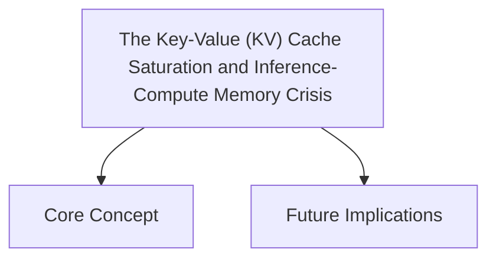

# The Key-Value (KV) Cache Saturation and Inference-Compute Memory Crisis

Detailed information about **The Key-Value (KV) Cache Saturation and Inference-Compute Memory Crisis**.

```mermaid
graph TD
    A["The Key-Value (KV) Cache Saturation and Inference-Compute Memory Crisis"] --> B["Core Concept"]
    A --> C["Future Implications"]
```
