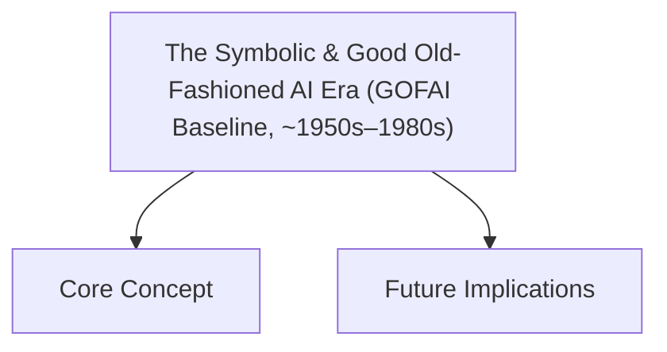

# The Symbolic & Good Old-Fashioned AI Era (GOFAI Baseline, ~1950s–1980s)

Detailed information about **The Symbolic & Good Old-Fashioned AI Era (GOFAI Baseline, ~1950s–1980s)**.

```mermaid
graph TD
    A["The Symbolic & Good Old-Fashioned AI Era (GOFAI Baseline, ~1950s–1980s)"] --> B["Core Concept"]
    A --> C["Future Implications"]
```
